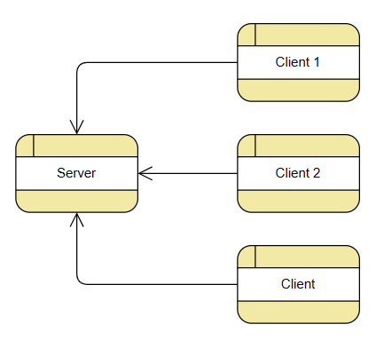

# Simple Chat Application

This is a simple chat application with a basis End-to-End Encryption and Authentication.

## Table of Content

[Simple Chat Application](#simple-chat-application)

-   [Table of content](#table-of-content)
-   [Getting started](#getting-started)
    -   [Set up](#set-up)
    -   [Project structure](#project-structure)
    -   [How to run](#how-to-run)
-   [Design architecture](#design-architecture)
    -   [Standards used](#standards-used)
    -   [How do te clients talk](#how-do-te-clients-talk)
-   [Libraries used](#libraries-used)
-   [Limitations](#limitations)
-   [References](#references)

## Getting Started

> **Important:** Python3 is required for the project.

### Set up

1. To get started with the project clone the repository and go to the project directory.

```bash
git clone https://github.com/A-raj468/chat-e2ee
cd chat-e2ee
```

> **Note:** Step 2 is optional, but recommended to isolate the dependencies.

2. Create a python virtual invornment and activate it. One way to do so is to use venv.

```bash
python -m venv venv
source venv/bin/activate
```

3. Install the required dependecies.

```bash
python -m pip install -r requirements.txt
```

### Project structure

```
chat-e2ee
├── README.md
├── client.py
├── keys
│   ├── <client 1>
│   │   ├── priv.pem
│   │   └── pub.pem
│   ├── <client 2>
│   │   ├── priv.pem
│   │   └── pub.pem
│   └── ...
├── model.png
├── requirements.txt
└── server.py
```

### How to run

1. Run the server in a terminal.

```bash
python server.py
```

2. In seperate terminals, start clients whose keys are present in the `keys` diectory of the project. Enter the name of the client when prompted.

```bash
python client.py
```

3. To send message from one client to another, type the message you want to send, press `ENTER`, enter the name of the reciever and hit `ENTER`.

```console
<message_to_send>
To: <reciever>
```

4. To add new clients, add a directory in the keys diretory and add private and public RSA key pair as `priv.pem` and `pub.pem` respectively.

```bash
mkdir keys/<client>
cd keys/<client>
openssl genrsa > priv.pem
openssl rsa -pubout < priv.pem > pub.pem
```

## Design Architecture



### Standards used

I used hybrid encryption in order to send messages. Each message is also authenticated(wiht a signature for PKE and with a HMAC for a SKE).

Standards used for security:

-   RSA-OAEP for asymmetric encryption
-   RSA-PSS for asymmetric authentication
-   AES-CBC for symmetric encryption
-   HMAC for symmetric authentication
-   SHA256 for hashing
-   PBKDF2(from PyCryptodome) as Key Derivation Function
-   TCP for connection between server and clients

### How do te clients talk

Public Signature Keys are available to all the clients in order to verify the session key that it is not coming from an imposter.

When a client A connects to the server and tells its name. After than it sends its PKE public key to the server (along with attached signature) to the server. The server tells other clients that client A has joined and this is the public key it sent along with the signature.

The other clients verify the signature and use the public key to send the session keys, SKE symmetric key and HMAC key, (encrypted with the public key and signed). Each client has seperate session keys for each other client.

After the session keys are sent, the clients use session keys for further communication (actual messaging).

Each message transfer happens via the server.

## Libraries used

-   [PyCryptodome](https://pypi.org/project/pycryptodome/)
-   [json](https://docs.python.org/3/library/json.html)
-   [os](https://docs.python.org/3/library/os.html)
-   [socket](https://docs.python.org/3/library/socket.html)
-   [threading](https://docs.python.org/3/library/threading.html)

## Limitations

-   Uses TCP connection without TLS. It makes the connection insecure and potentially exploitable.
-   A compromised server can potentially drop messages, so a denial of service(DOS) attack is possible.

## References

-   [Simple chat room tutorial](https://www.youtube.com/watch?v=3UOyky9sEQY): For understanding socket programming with multithreading in python
